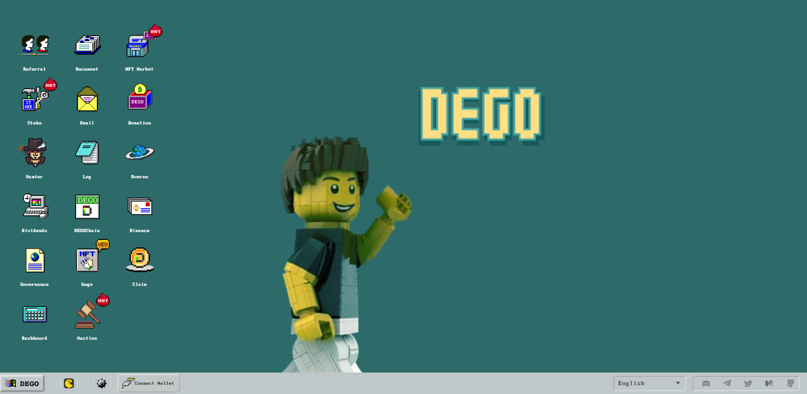

# Dego Finance

DEGO Finance 是一个 NFT+DeFi 协议和基础设施，具有两个功能： 该项目充当独立且开放的 NFT 生态系统，将用户吸引到区块链空间。NFT 套件提供涵盖 NFT 整个生命周期的服务，使任何人都可以发行 NFT、参与拍卖和交易 NFT。

DEGO Finance 还在构建 NFT 协议以提供跨链的第 2 层基础设施。通过建立在币安智能链、以太坊和波卡等多个区块链上，DEGO Finance 使区块链项目能够获得用户、分发代币并开发更多样化的 NFT 应用程序。

自 DEGO NFT 空投推出以来，DEGO 社区呈现爆炸式增长，一周内 Twitter 关注者达到 39k，telegram 关注者达到 48k。感谢您的参与！为推动DEGO全球社区的发展，现面向全球招募志愿者。我们将从所有志愿者中选出10名担任DEGO大使，期待所有对DEGO充满热情的人加入我们！

DEGO是一个开源项目，倡导去中心化、开放、自由和进化的精神。社区是DEGO的灵魂，DEGO大使是所有成员社区发展的向导。

