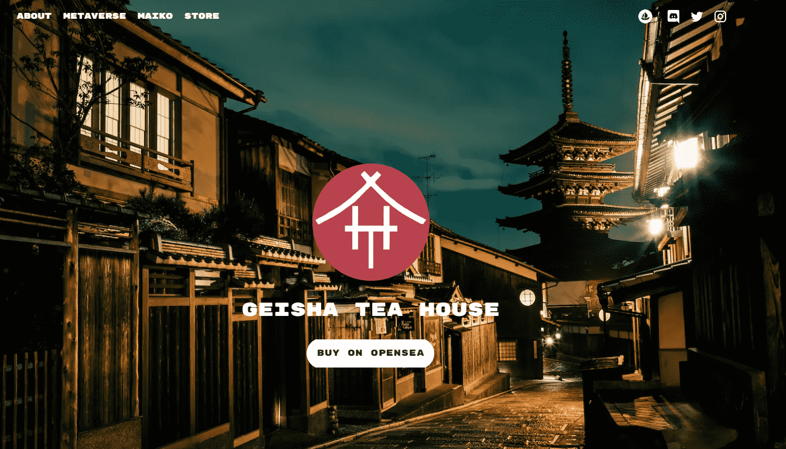

# Geisha Tea House

在日本，艺妓是男性的女性职业艺人。不不，听我们说完。虽然有些人拥有迷人的外表，可能会被误解为调情，但艺妓不应被误认为是妓女。

一旦艺妓完成训练，她就会被雇用在茶馆的宴会上表演，这是有能力的绅士们商务和休闲聚会的地方。

除了具有娱乐性外，艺妓也是在表演期间偷听主持人谈话时获得的重要信息的来源。是的，我们也喜欢那部分。

最后但并非最不重要的一点是，只有最富有的商人和最有影响力的政治家才会光顾艺妓。

2049 年 9 月 4 日，世界遭受了一场毁灭性的网络攻击。它不仅夺取了数字生活和不可避免的人们的收入和安全，而且还伴随着一场全球性的机器人极端分子袭击，抹去了我们所知道的人类。

只有少数人在袭击中幸存下来，其中一个是半机械人艺妓 Mineka和来自隐蔽而坚固的 Akirelu Okiya 的少数年轻 Maiko。

除了炫耀你美丽的艺妓之外，你还可以与志同道合的人交流，你们中的一些人获得了免费的艺妓 NFT，你可以结识Kevin O'Leary和许多其他人，通过我们的发射台尽早进入流行的白名单，并且获得免费的 Maiko，仅举几个GTH 实用程序。

因此，在 Discord 上关于 Roadmap 1.0 的交流即将结束，而我们正在用令人兴奋的东西完成 Roadmap 2.0，敬请期待更多！请留意我们在此处和社交媒体渠道上的公告。

