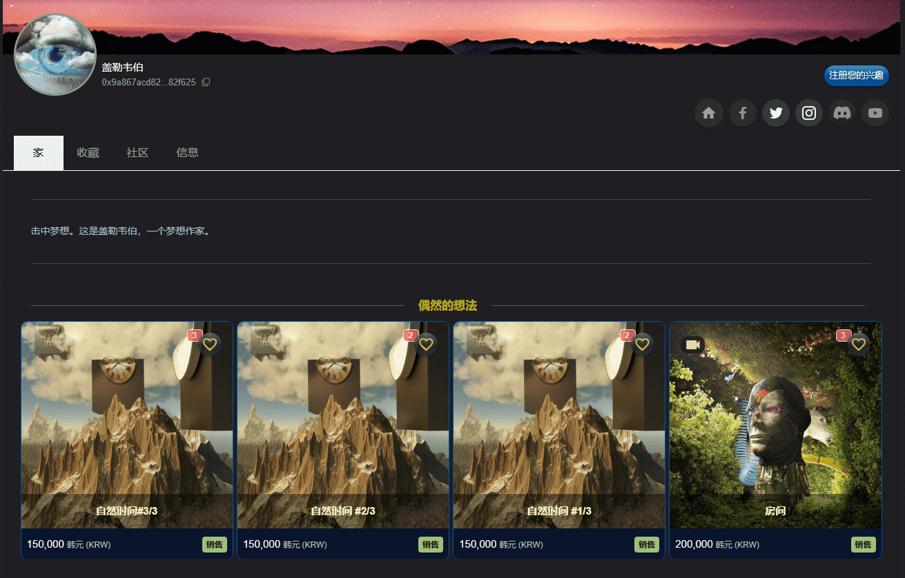

# GellerWebersStrangeAdventure

随着时间的流逝，太阳升起落下，风起，落叶，流水。自然界中的时间只是作为一种现象存在，并没有时间的概念。时间是人类创造的“概念”。我们接受了符合这个概念的一切。

如果一个人对写作有更多的了解，更多的人也会知道我将留下的地球的未来。我每天晚上都专注于教韩文和写书。

恩！新的 NFT 艺术品出售！Back Then '90's Public Phone Booth' 让我们留住当时的回忆。仅限开放海。

