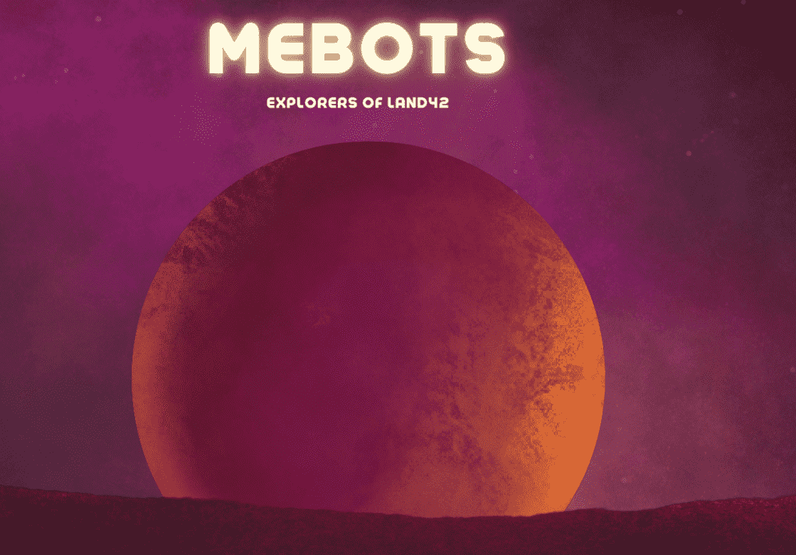

# Gen-0 Mebots

一个 NFT 健身收藏品，随着您采取 IRL 的每一步而变得更加独特和有价值。今天铸造限量版 (9,999) Gen-0 Mebot。

您的 MEBOT 是您的数字孪生生物化身。您的步骤有助于探索新的竞争性游戏空间

一旦你铸造了一个 Mebot，你的步骤就会为你赢得心脏代币。您还可以在 Land42 中购买一块土地，让您在健身比赛中与其他玩家竞争并获得奖品。

当您通过步骤和锻炼获得 Heart 令牌时，您可以决定将您的 Gen-0 Mebot（限量 9,999 个）培育成 Gen-1 Mebot。培养您的 Babybots，让它们成熟，它们独特的下一代特征将被揭示。

