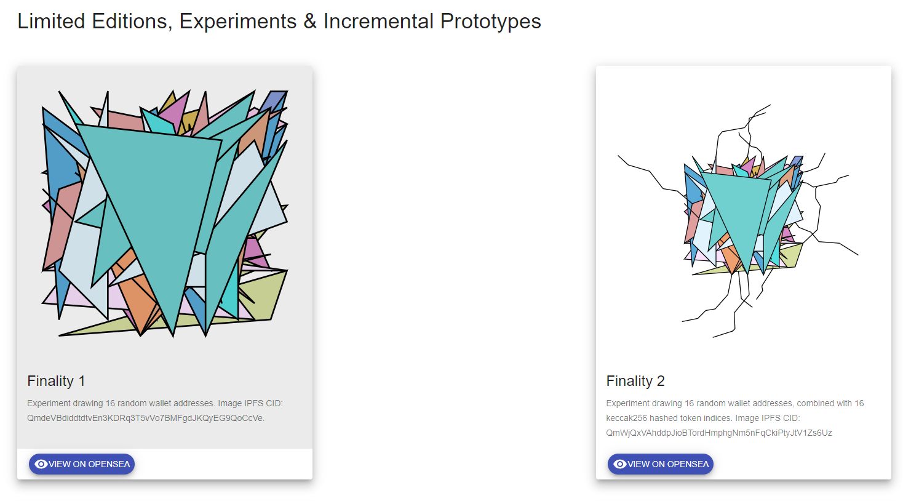

# Metro by Gener8tive

从现实世界的城市数据中衍生出的一系列生成性抽象建筑集合。

Metro 受到 Theo van Doesburg 和 Cornelis van Eesteren 在 1920 年代初期的新塑料反建筑项目的启发，是一项利用 PLUTO 数据生成城市街区抽象表示的研究。

简约的链上生成组合，每个组合都来自单个 keccak256 哈希值。在第一个生成的不可替代 ERC721 令牌中。

组合是独一无二的，由部署到以太坊区块链的智能合约按需创建。存在250 种组合物的有限供应。已创建所有250 个乐曲。

创建乐曲需要0.275Ξ的费用。其中15%用于进一步的开发和项目。其余部分安全地捐赠给GiveDirectly 的以太坊钱包0xc746...A42，以重塑捐赠并帮助生活在极端贫困中的真实人们。总共捐赠了55Ξ - 感谢您对这个项目的支持！

艺术形式在于探索数据、技术和美学交叉的过程。

所有 Gener8tive 系列都是 100% 独特过程的结果。我的目标始终是在不使用商业工具的情况下创建混合的、不可变的和程序化的媒体。这意味着所有原型设计、Solidity 合约和 React DApp 组件都是从头开始手工制作的。

