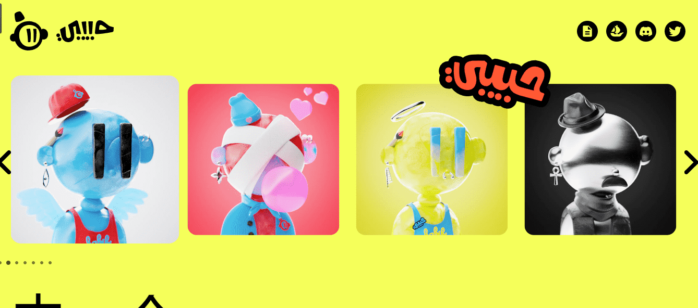

# Generation: Habibi

由一个HABIBI为所有HABIBIS制作1,000 个单独渲染的Habibis正在寻找爱情！

这一切都始于一个词habibi，哈比比意味着很多东西。这是热情的恋人之间的交流，是关心的朋友之间交流的文字。简而言之，它的意思是“最亲爱的”或“亲爱的”。

但这真的卖空了。除非你是阿拉伯人，否则很难解释它有多深。

Generation: Habibi 的初始掉落包含十个不同的世代，每个世代包含 100 个 Habibis，可供收集。随着 Habibi 社区的发展，持有者可以投票决定是否、何时以及在后代中释放多少。社区处于控制之中。

