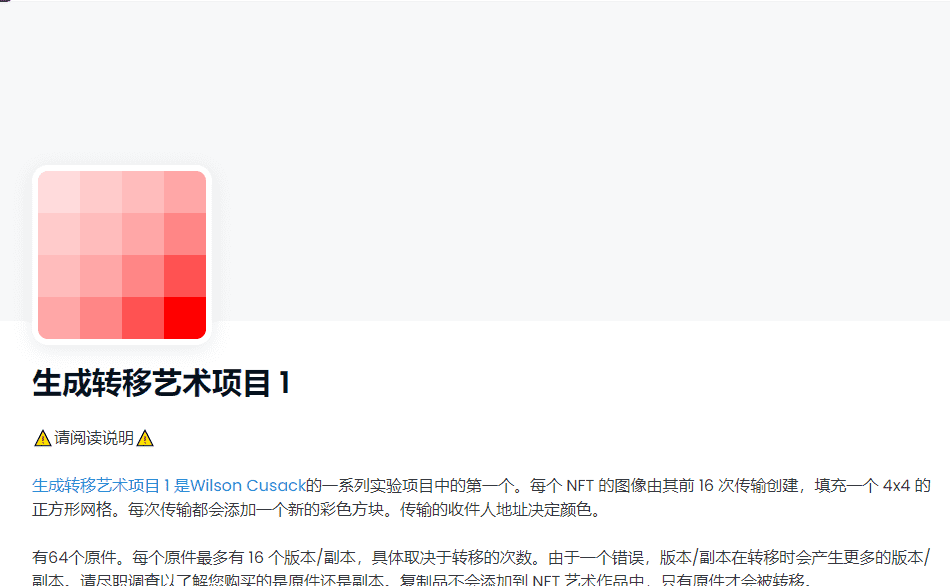

# Generative Transfer Art Project 1

有64个原件。每个原件最多有 16 个版本/副本，具体取决于转移的次数。由于一个错误，版本/副本在转移时会产生更多的版本/副本。请尽职调查以了解您购买的是原件还是副本。复制品不会添加到 NFT 艺术作品中，只有原件才会被转移。

如果 url 末尾的数字与显示的“Token #...”匹配，则它是原始的。还有一组包装好的原件。访问我们的网站和 Discord 了解更多信息。

