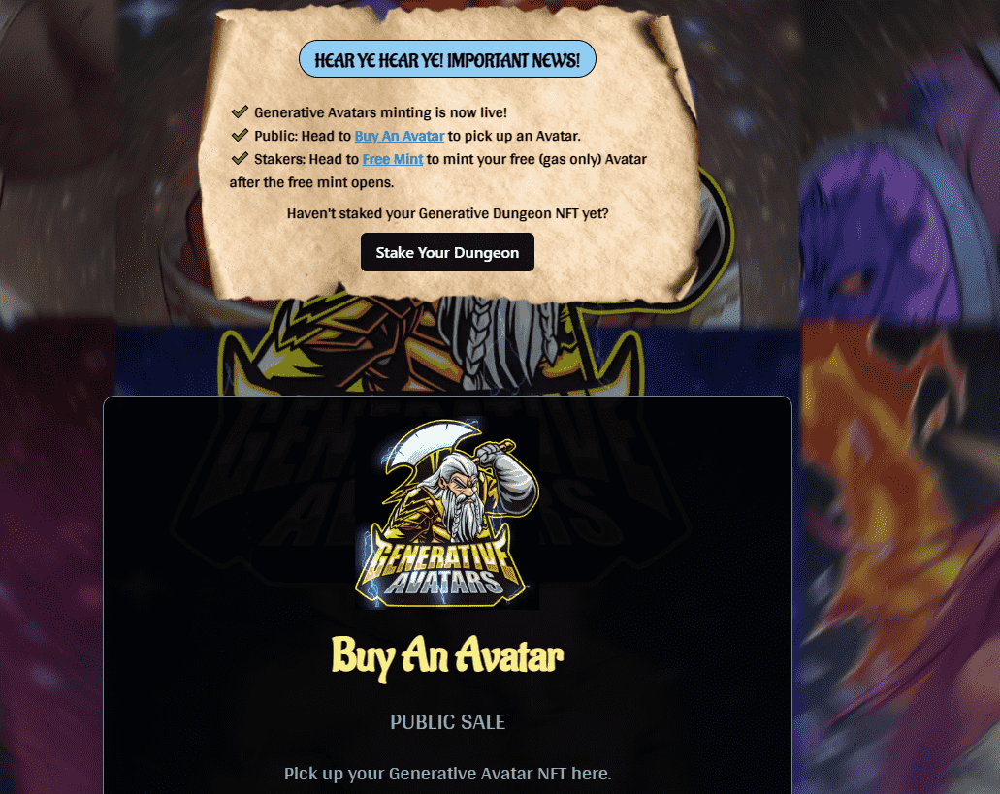

# Generative Avatars by DungeonMaster

在我们的网站上玩，直接在 OpenSea 上玩，或者像传统的 NFT 一样将肖像上传到您的社交媒体资料。由你决定。立即在 OpenSea 上获取您的，并开始自定义您的地牢。或者质押它并获得奖励，您可以在我们的 Bazaar 中兑换 WL 点，用于几乎任何即将推出的大肆宣传项目。

生成地牢是一个集合可玩的，程序生成，完全可编辑的 NFT 地牢。没错，这些不仅仅是您可以*在*游戏中使用的收藏肖像，而是每个 NFT 本身就是一款成熟的游戏。

这个项目是由地牢大师、首席艺术家和程序员启动的。他想创建一个完全不同于现有任何东西的 NFT 集合。目标很简单。它必须是交互式的。它必须立即加载。它必须可以直接在 OpenSea 上播放。更重要的是，他开始玩得开心，结交新朋友，并可能在此过程中学到一些东西。

