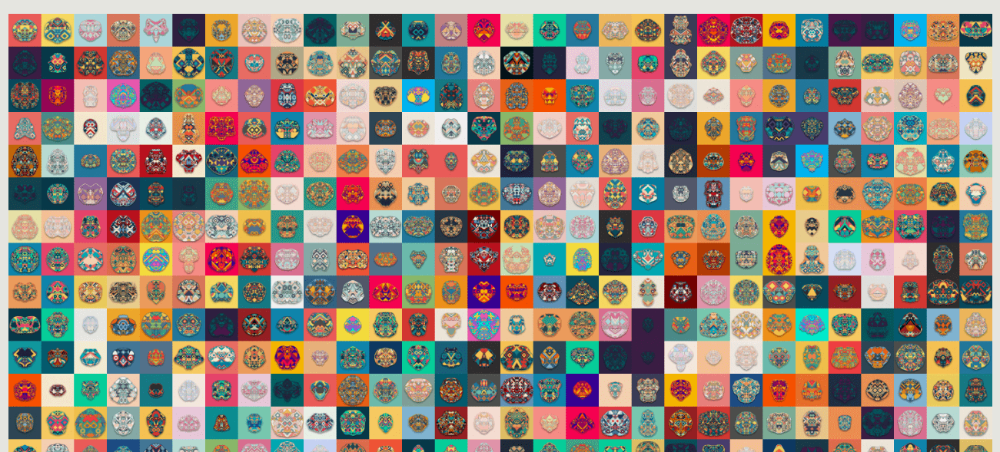

# Generativemasks

这个 NFT 会自动“生成”一个个不同表情的独特面具，每次在 NFT 市场上重新加载面具时，你都可以享受不同颜色的面具。

这项工作的灵感来自于在对称排列的几何图案中发现一种生命感。我试图用意想不到的形状和图案来表达美洲原住民图腾柱和日本原住民妖怪可怕而又迷人的气氛。生成艺术 NFT 收藏。每次刷新页面时，NFT 都会改变颜色。

takawo 开发了一种算法，可以让 10,000 个图形中的每一个都成为具有自己个性的面具

通过组合多种几何图案和形状。

