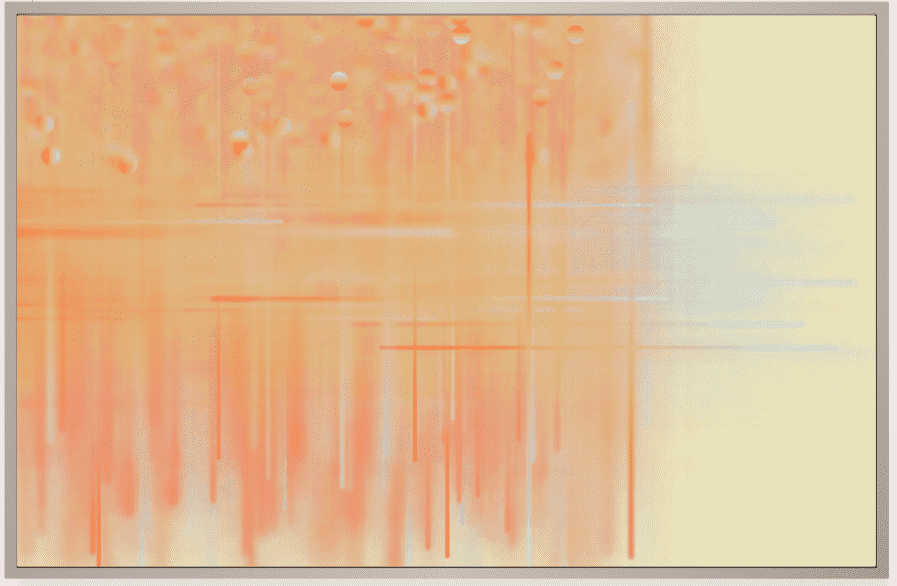

# Generic Profile Pictures

这 2,200 张图像是 125,000 个可能变体的子集。使用的颜色和渐变是手工混合的，而组合是使用代码随机生成的。铸币厂默认是两个的倍数，每个钱包地址最多两个。没有铸币费。

铸币体验构建为一个简短的交互式对话，最终能够在以太坊区块链上铸币一个通用 PFP。作为铸币过程核心的叙事实验，SlowMinting™ 试图摆脱恐慌的 FOMO。

图像中缺乏情感对任何对话都有镇静作用，无论是在上下文中还是在上下文之外，都会降低对话的强度。这是通用 PFP 的核心理念之一。在野外看到另一个持有者应该作为平静和深思熟虑的话语的象征性标志。

图像构造简单，但包含熵元素。一个名为“混合”的初始背景层为上面的“渐变”层添加了颜色，形成了*主体*的底层混合渐变。

然后“模板”层形成*主体*的形状，它在视觉上也充当个人资料图片的背景颜色。然后将“高光”和“纹理”均匀地应用于每个图像以添加纹理和深度。

通用 PFP 在某种程度上是一封写给匿名和假名的情书，以及加密社区对此的接受。它们呈现出一种统一而实用的视觉语言，以*否定*身份作为一种解放的理想。它们也很难进行逆向工程，元数据中的各个配色方案都被赋予了唯一的名称，这使得逆向搜索特征成为一项不平凡的任务。绝大多数 PFP 没有颜色以外的视觉可识别特征。它们是无性别的，当用作化身时，充当交流的空白画布。

