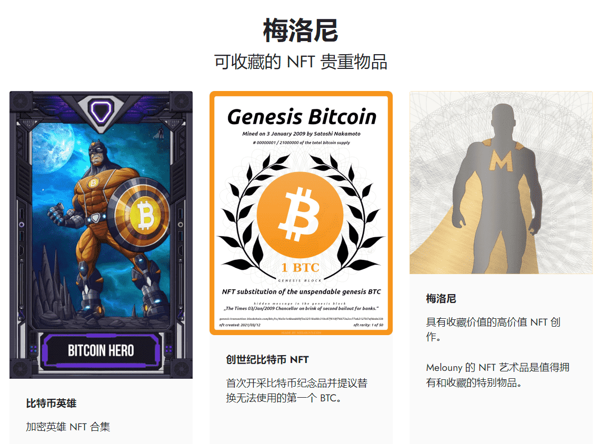

# Genesis Bitcoin

NFT 纪念品和提议的不可使用的 BTC 的替代品。

Genesis Bitcoin NFT 不仅代表了加密历史上最伟大的事件，而且还代表了中本聪本人在 2009 年 1 月 3 日开采的第一个比特币的 所有权。

为什么还要所有权？

原始创世比特币不能被使用（转移给某人），因为创世区块是硬编码在软件中的——因此不是区块链数据库本身的一部分。这使得它在被计入比特币总供应量时对处理是不可见的。

创世比特币 NFT 以 Terra nullius 的方式收回了无法使用的创世比特币的价值。因此，创世比特币可以通过出售这个创世比特币 NFT 纪念品来替代使用。

来自创世区块的 50 个可互换 BTC 中的每一个都有自己的代表，作为一个单一的创世比特币不可替代代币。因此，一个 Genesis 比特币 NFT 的全价是 1 BTC 增加了纪念品附加值。真正的价值基于共识。

创世比特币将永远位于创世地址 1A1zP1eP5QGefi2DMPTfTL5SLmv7DivfNa
您可以查看有史以来的第一笔比特币交易。

实际价值在于这张图背后的 NFT 代币；图片本身就像钞票上的墨水。

创世比特币 NFT 的创建者并没有声称自己是中本聪，也没有拥有创世地址私钥，在这种情况下它是无用的。无论如何，这就是 NFT 的全部意义所在。

