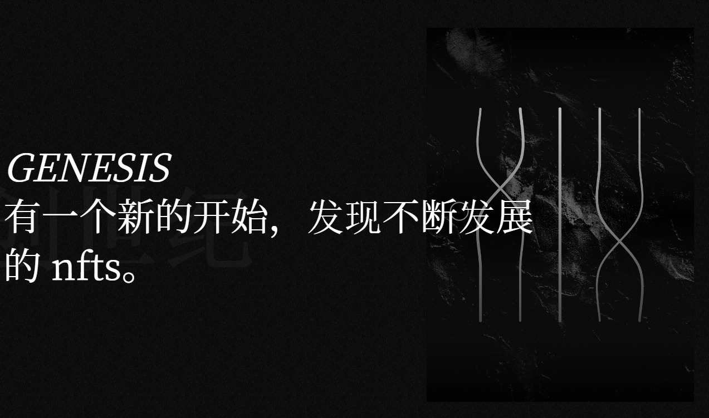

# Genesis Blocks Art

GENESIS NFT 会随着每次二次销售而发展。买家的钱包地址影响一代，为每次转账创造一个新的独特部分。它增加了 NFT 的稀有性和价值。

我是瑞士的网络和加密开发人员。我的目标是通过工具和项目使这个空间成为一个更安全的地方。我一直在尝试通过代码带来创新。

随着创世 NFT 的每次转移，从收单方钱包地址的值中生成一条新线，并重新生成艺术品，从而创建一个新的独特作品。

该基金是我感谢 Genesis Blocks 框架的早期支持者的方式。只有第一个集合会从中受益。它将以 50 Ξ 启动。至少一半的二级销售费用将被添加到基金中。
持有人将能够投票决定如何投资（NFT、私人销售等）部分基金以使其增长。
下一次下跌产生的一些利润也将存入该基金。

