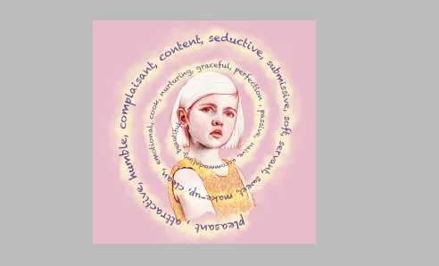

# GENESIS COLLECTION Zodiacs by Raquel Casilda

这是我的创世纪系列：“十二生肖：符号与身份”，围绕着象征主义的使用，信仰与占星术与身份和人的性格有关。我已经包含了一些与不同星座相关的符号，如下所示：行星、元素、花朵和石头。你与它的联系有多深？

1 Zodiac 的所有者：在 FND 上私下出售一件物品，保留价格折扣 10%（所以绕过 24 小时拍卖）

拥有 6 个生肖的人：在 FND 上私下出售一件物品，保留价格折扣 40%（所以绕过 24 小时拍卖）

所有生肖的所有者（每个 1 版）赢得我的 1/1 或委托定制艺术品或肖像中的一个，您的选择。

任何 Zodiacs 的拥有者都将在公开发售前获得我在 OS 中的下一个 1/1 收藏的特别优惠。

Raquel Casilda 的 GENESIS Zodiacs 系列是什么？

Raquel Casilda 的 GENESIS Zodiacs Collection 是一个 NFT（非同质代币）系列。存储在区块链上的数字艺术品集合。

Raquel Casilda 代币的 GENESIS Zodiacs Collection 有多少？

Raquel Casilda NFT 共有 12 个 GENESIS Zodiacs Collection。目前，12 位所有者的钱包中至少有一个 Raquel Casilda NTF 的 GENESIS Zodiacs Collection。

Raquel Casilda 拍卖中最昂贵的 GENESIS Zodiacs 系列是什么？

Raquel Casilda NFT 出售的最昂贵的 GENESIS Zodiacs Collection 是 Aries。它于 2022-06-09（3 个月前）以 117.1 美元的价格售出。

