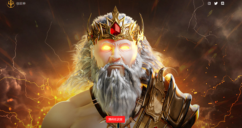

# Genesis Gods: By NaelG

NaelG 的 Genesis Gods 是一个优质的 NFT 集合，由 7,777 个独特的 NFT 组成，这些独特的 NFT 基于希腊神话中的众神从现在作为以太坊区块链上的 NFT 生活的元宇宙的天堂降临。该系列包含 300 多个独特的、手工雕刻的 3D 特征，由受人尊敬的艺术家 NaelG 精心制作。加入我们的卫城众神冒险之旅。

NaelG 是 Genesis Gods NFT 系列的首席艺术家、设计师和创作者。他是一位受人尊敬的艺术家，在 3D 艺术和摄影方面拥有超过 10 年的经验。他是整个 BNB NFT 市场“NFTB.io”中销量第一的艺术家，现在他创建了 Genesis Gods 系列，在以太坊 NFT 场景中首次亮相。

这个阶段就是要为自己树立名声，并为超越黑社会的背叛铺平通往荣耀的道路。在第一阶段，我们计划每天举办社区活动，并将我们的社区建设成一个成熟的上帝小队。我们已经创建了超过 7 万美元的活动，我们计划在铸币后创建一个 10 万美元的社区基金，用于为我们令人惊叹的社区提供更多赠品和活动。

