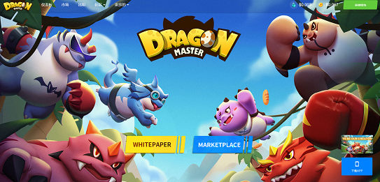

# Dragon Master Genesis Player

DragonMaster 是第一款基于区块链的元界游戏，融合了 RTS、MOBA、Collection 和 Play-to-Earn 游戏玩法。

未来将引入土地系统，让玩家可以自由发展自己的家乡，通过适当的部署防御对手，通过战斗和资源掠夺来增强自己，以及进行群体交战。

龙有 4 种尺寸，S / M / L / XL。尺寸越大，重量越重，攻击力越弱。玩家将有机会在创世龙蛋掉落或期货品种中获得他们的龙。龙将在5条赛道的战场上展开较量，双方玩家可以根据自己的策略选择赛道派出龙。在战斗中，体重较大的龙可以将较轻的龙推到轨道的尽头，并对被推的玩家造成伤害。当一名玩家的HP为零时，将宣布获胜者。

它绝对充满了战斗、权衡和其他战斗策略。玩家更容易将大型龙送到对手家中，还是更多小型龙？这一切都取决于玩家在整个战斗中的动态策略。

除了大小比拼模式外，还根据规则添加了多种龙类技能，一种技能可以克制或辅助另一种技能，让游戏更加有趣。

组队的可能性比你想象的要多，快来召唤你自己的龙队吧！

