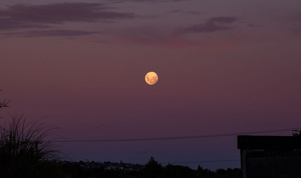

# Geodetic Memory

大地记忆庆祝我们与潜意识共舞的愿望，提出一个想法......并以艺术的名义塑造 Web3.0 实验。

在 Web3.0 中，每天都可能出现在“现实生活”中可能被认为离奇或不可能的场景。

Geodetic Memory 从萨尔瓦多·达利的超现实主义作品中汲取灵感，颂扬我们人类存在的神奇和奇异之美。

MintFace 于 2022 年 7 月 3 日记录了该位置。

“镜子门户”和“月亮脸”由 Dall-E 解释，然后由 MintFace 编辑，用于铸造并最终插入我们的集体记忆。

Clarity 最终会将我们的大地时刻连接到一个没有阴影或符号的单一框架中。

当它平衡、平滑但又极其明确时，它就是顶峰。

