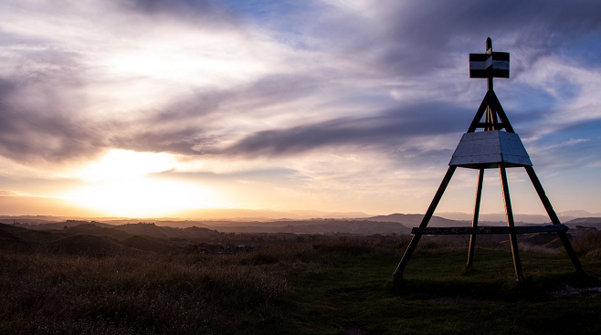

# Geodetic Moments - Light & Dark

Geodetic Moments 收录了 100 张“缺席”拍摄的照片。

每个大地时刻都将观众置于一个世界的中心，一个被爱的人不在。

你不能忘记它们，但你也不能继续前进。

你可能认识那个人。你可能就是那个人。

Geodetic Moments 创造了一个地方和空间，让您在缺席中感受到暂时的喘息。通过一个有利位置的镜头探索因失去而产生的许多情绪。

看着地平线并测量你的立场。

Geodetic Moments 探讨了我们观点的微小变化如何极大地改变我们所看到的。

每个视觉坐标都是在新西兰东海岸向上 127 米的 Pukekura 山顶上拍摄的。

一个坐标面向未来。一个坐标面向过去。

两者都代表了我们现在的立场。我们都是地球表面上点的坐标。

查看 MintFace x AI大地错觉]。查看 MintFace Geodetic Moment 版本：大地光与暗。

2021 年将仅发布 100 个独特的 1/1 版本。

Geodetic Moment NFT 的所有者有权在持有 NFT 的同时将图像用于个人用途（以及经许可的商业用途）。

