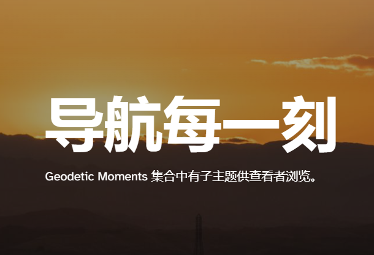

# Geodetica

Geodetic Moments 集合中有子主题供查看者浏览。

大地标记代表了所爱之人的象征性替代品，现已缺席。

你面对的方式决定了你所看到的。面向前方以获得更积极的看法。向后看，记住你已经走了多远。

每天都可以是大地测量时刻日。星期六原来是最受欢迎的一天。

Geodetic Moments 对人来说更好，但很少有人能感受到你在那里的感受。

天气是悲伤情绪过山车的隐喻。每个赛季都在处理所发生的事情，就这样。

Geodetic Moment 集合中有更多隐藏的特征，您可以探索和发现自己。

