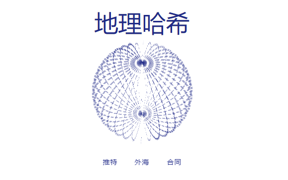

# Geohashes (for Everyone)

过去 7 天内没有售出 Geohashes (Genesis Collection)。

geohash将地理位置编码为存储在链上的一串字母和数字。故意省略图像和位置，以供其他人解释和合并。

Geohashes Genesis 包含原始 4 个字符 geohashes 中的 1,251 个，代表一个大约 39.1km × 19.5km 的块。合约铸币厂已关闭。这些都是 1:1，稀有度取决于您如何评估位置。

它们可以映射到地球或任何坐标系。例如u09t是一个包含法国巴黎的 geohash。

虽然在地球上可视化 geohash 很容易，但您可以将坐标映射到火星、月球，甚至是元宇宙中的新行星。

我们的 Geohashes Genesis Collection 是对新区块链原语的实验。创建了 1,251 个，铸币厂现已关闭。

