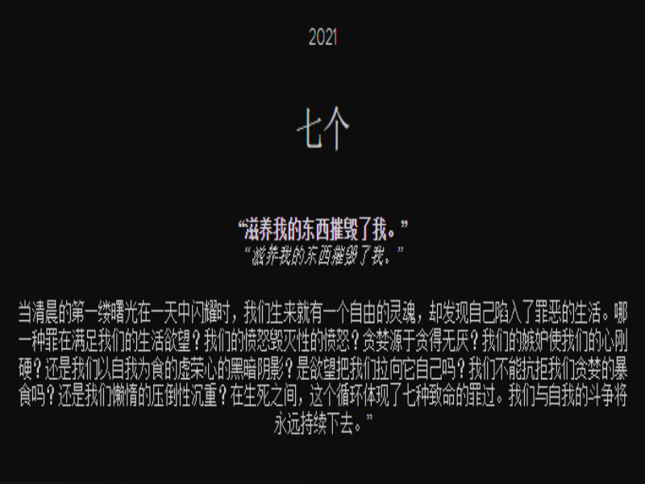

# Geren Limited Editions

Mehmet Geren 是一位屡获殊荣的 (IPA) 视觉艺术家和艺术总监。Geren 的艺术作品在全球范围内展出，并被*ELLE、L'officiel、Vogue Portugal、Tatler Magazine*等多家机构推荐。

当清晨的第一缕曙光在一天中闪耀时，我们生来就有一个自由的灵魂，却发现自己陷入了罪恶的生活。哪一种罪在满足我们的生活欲望？我们的愤怒毁灭性的愤怒？贪婪源于贪得无厌？我们的嫉妒使我们的心刚硬？还是我们以自我为食的虚荣心的黑暗阴影？是欲望把我们拉向它自己吗？我们不能抗拒我们贪婪的暴食吗？还是我们懒惰的压倒性沉重？在生死之间，这个循环体现了七种致命的罪过。我们与自我的斗争将永远持续下去。”

