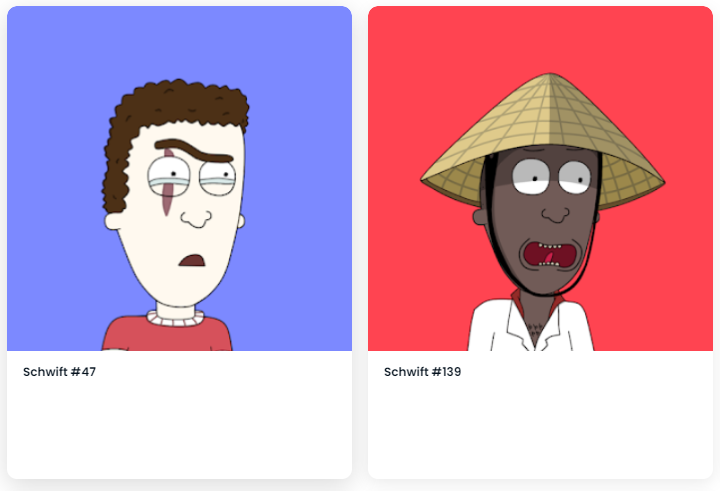

# Get Schwifty Club

Get Schwifty Club 是存储在以太坊区块链上的 10.000 个独特的 ERC-721 代币的集合。每个 NFT 都是独一无二的，并且是从总共 150 多个特征中随机生成的。每个 NFT 都具有独家会员资格和对扩展功能的访问权限。

什么是 Get Schwifty 俱乐部？

Get Schwifty Club 是一个 NFT（非同质代币）集合。存储在区块链上的数字艺术品集合。

Get Schwifty Club 代币有多少？

总共有 459 个 Get Schwifty Club NFT。目前，220 位车主的钱包中至少有一个 Get Schwifty Club NTF。

