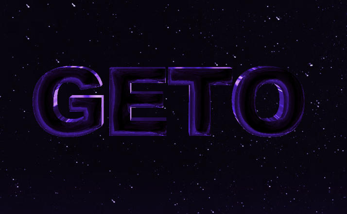

# GETO THE UNION

我们项目的大标题和项目团队的名字“GETO”，意味着一个文化综合空间，各种文化和人的才能自由表达。我们项目团队创建的文化综合体“GETO”有两个词源。

首先，“GETO”源自“Ghetto”，意思是以前的犹太人接待区或集体贫民窟。《安妮日记》等优秀书籍，布鲁斯和爵士等世界音乐流派，以及现代说唱和嘻哈等各种文化都诞生于战争或贫困的空间。我们的“GETO”还包含了一个空间的意义，一个不同的人可以克服各种逆境，创造出精彩的文化内容和项目团队的愿望。

其次，“GETO”是四个词的合成词：Genius、Energy、Talent、Origin。它包含“发挥才能的创造力和能量的源泉”的含义。一个具有各种才能的人可以自由交流以产生创意和流行内容的社区。那就是'GETO'。现在正在阅读这篇文章的每个人！参加文化综合体“GETO”。并在“GETO”社区中，成为能够充分发挥创造力和才华的“GETOLIAN”！

