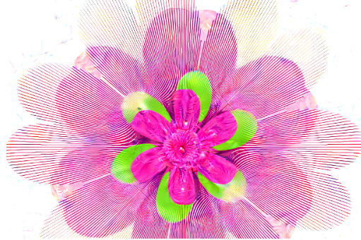

# Giga-Garden LSD

 两年多前，我们的开发人员 Chris 创建了一个程序，可以使用数学方程式绘制简单的花朵。2021 年 5 月，鲜花生成器被修饰了额外的变量和随机性，以创造更适合 NFT 世界的无限可能性。这些设计仍然需要一种方法来保证每一朵花都是独一无二的，因此 4k Deep Dream AI 的开发开始了。你永远不会知道下一朵花会是什么样子或能够重新创造它。

​       创建和上传 12,000 张 4k 分辨率的图像被证明是一个挑战！程序绘制一朵新花大约需要 10 秒。然后将该图像上传到专门的机器学习计算机，人工智能需要创建如此详细的 4k 图像。使用一台亚马逊服务器（1 个 Nvidia Tesla V100 GPU），Deep Dream 一张图像大约需要 90 秒。制作一朵花只需要不到两分钟，还不错吧？对于 12,000 张图像，这意味着使用 AI 日夜打磨渲染整个收藏集需要 16.67*天。*

​       我们设定了发布日期，没有两周的时间等待鲜花。我们唯一的选择是将计算工作分配给三台服务器上的六张显卡。有了这个急需的改进，花朵最终完成渲染只用了 4 天。下载了所有 250GB 的 PNG 文件并关闭了 AI。

​       将 1/4 TB 的数据上传到 IPFS 似乎是一个挑战，直到意识到上传需要几天时间之后似乎是不可能的。幸运的是，Nate 拥有千兆互联网（比 Chris 的互联网快 30 倍）。我们意识到，我们可以及时上传鲜花以供发射的唯一方法是将鲜花加载到闪存驱动器上，然后在全国范围内邮寄给 Nate。一切都按时进行，下降顺利。Giga Garden 拥有一群友好的迷幻人，诞生了！我们可以一起进一步推动 NFT 的界限！

