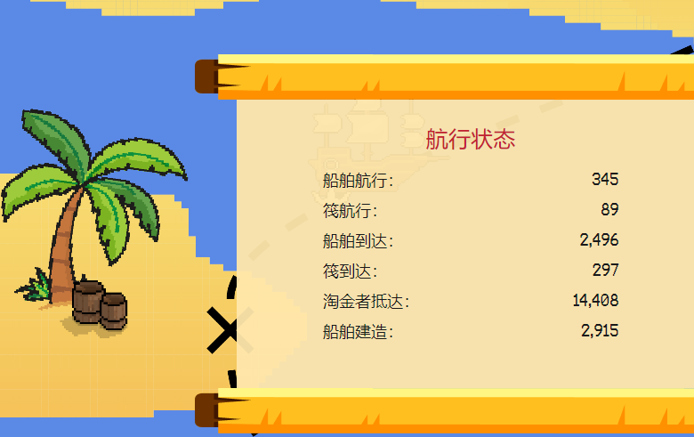

# Gold Hunt Game - Rum

黄金矿工和海盗在METAVERSE中争夺金银岛的金币。通过挖掘 $GGOLD或与野蛮海盗合作以获得您真正应得的宝藏，以诚实的方式致富。

曾几何时，在一个遥远的虚拟世界中，一艘热切的冒险者船在海洋中航行，寻找新的世界。船舱男孩喊道：“着陆嗬！土地嗬！” 船停泊在一个无人居住的大岛上。幸运的是，这个岛上有大量的金矿，所以冒险者变成了淘金者。他们把金条运到大陆，变得足够富有，可以雇佣帮手。但他们的好运并没有持续多久。寻宝的海贼们听说有一个岛内有财源滚滚，连忙赶到岛上抢劫过往的船只！

没有人能阻止可怕的海盗和每天、每小时都在发生的抢劫。于是岛上的总督与海盗签署了一项条约：金矿工将用开采的GGOLD向海盗支付费用，以便安全航行到大陆。但是，如果一个金矿工回到大陆，不想再支付费用，海盗如果追上他们，就会把那个金矿工抢走。

Gold Hunt 是对著名的 Wolf Game 的致敬，该游戏非常受欢迎，但不得不偏离原计划并停止销售代币。我们觊觎原版游戏中最好的部分，并将战斗带入一个新的现实，野蛮的海盗和勇敢的金矿工在金银岛上争夺黄金。大多数机制对于以前玩过的人来说都是众所周知的。因此，我们邀请您深入研究重振并令人难以置信的激动人心的冒险，以便玩到最后，因为我们已经修复了激发我们灵感的原始游戏的所有错误和漏洞。

