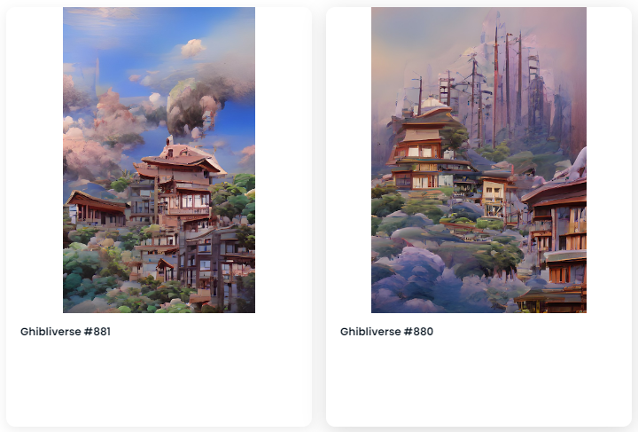

# Ghibliverse

什么是 Ghibliverse？

Ghibliverse 是一个 NFT（Non-fungible token）集合。存储在区块链上的数字艺术品集合。

有多少 Ghibliverse 代币？

总共有 1,000 个 Ghibliverse NFT。目前，419 位所有者的钱包中至少有一个 Ghibliverse NTF。

Ghibliverse 最昂贵的销售是什么？

售出的最昂贵的 Ghibliverse NFT 是 Ghibliverse #478。它于 2022-06-16（2 个月前）以 17.9 美元的价格售出。

最近卖出了多少 Ghibliverse？

过去 30 天内售出了 27 个 Ghibliverse NFT。

Ghibliverse 需要多少钱？

在过去 30 天里，最便宜的 Ghibliverse NFT 销售额低于 8 美元，最高销售额超过 12 美元。Ghibliverse NFT 在过去 30 天内的中位价格为 10 美元。

