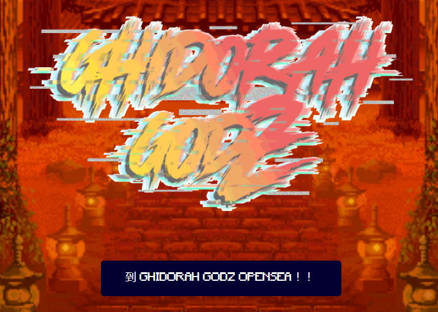

# GHIDORAH GODZs

GHIDORAH GODZ 是 5,999 个 GHIDORAH 的集合，这些 GHIDORAH 是国王 GHIDORAH 的后代。在基多拉国王牺牲自己之后，他的权力被划分并产生了不同独特种族的后裔。 

GHIDORAH GODZ”背后的想法是由我们的所有者 RYUJIN 提出的一个问题开始的，“NFT 和 METAVERSE 对你来说是什么？” 目前没有太多答案，因为我们都以不同的方式解释了这些问题。因此，我们决定创建一个项目，将社区聚集在一起，以解决这些棘手问题的未知答案。在我们的社区和路线图的帮助下，我们相信我们将能够对什么是 GHIDORAH GODZ NFT 和 METAVERSE 有自己的答案。

很久很久以前，在雄伟的藤村山上，有一座被称为琉宫的宫殿。这座宫殿被一个被称为基多拉国王的神秘人物保护着。凭借难以想象的力量、智慧和远见，吉多拉国王为他的追随者带来了祝福。这引起了七海七军的羡慕。不久，军阀们制定了推翻吉多拉国王和他的追随者的计划。

在接下来的几个月里，吉多拉国王的军队和他的追随者被七海魔军阀制造的一种未知的有毒病毒慢慢消灭了。随着基多拉的光环逐渐消失，军阀发动了最后的进攻，导致基多拉国王坠入深渊。在一场巨大的爆炸中，吉多拉国王牺牲了自己。在他解体的过程中，他的身体发出五道强大的光芒，升天，然后落入远方，再也见不到了。

 

许多世代之后，两个堕落的光芒孕育了与吉多拉国王相似的新兴部落。这两个 GHIDORAH 部落被命名为 GENESIS 和 DIVINE。GENESIS TRIBE 拥有倍增的力量，以击败他们的敌人。与此同时，神圣部落可以相互融合，变得更强大。吉多拉国王的两个后裔都很强大。但与来自七海的海魔军阀较量，他们是脆弱的。这导致两个部落学习和合并，合并成 GHIDORAH MONSTERZ 以击败军阀。这种演变为神秘之旅注入了新的活力。

