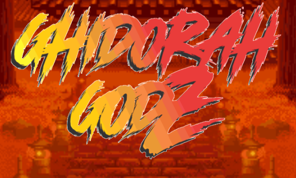

# GhidorahGodz

我们的 GHIDORAH GODZ 系列中将有 4,000 个神圣的 GHIDORAH。

 神圣的 GHIDORAH 拥有进入“元大屠杀”的权力！

这些古老的 GHIDORAHS 不会包含在 GHIDORAH GODZ 的供应链中。ANCIENT 将成为我们社区成员和持有者的免费铸币厂！远古的吉多拉力量仍未被揭示！！

“GHIDORAH GODZ”背后的想法是由我们的所有者 RYUJIN 提出的一个问题开始的，“NFT 和 METAVERSE 对你来说是什么？” 目前没有太多答案，因为我们都以不同的方式解释了这些问题。因此，我们决定创建一个项目，将社区聚集在一起，以解决这些棘手问题的未知答案。在我们的社区和路线图的帮助下，我们相信我们将能够对什么是 GHIDORAH GODZ NFT 和 METAVERSE 有自己的答案。

GHIDORAH GODZ 是 5,999 个 GHIDORAH 的集合，这些 GHIDORAH 是国王 GHIDORAH 的后代。在基多拉国王牺牲自己之后，他的权力被划分并产生了不同独特种族的后裔。 

