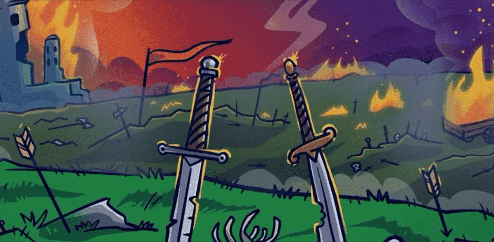

# Ghost Goblins

Ghost Goblins 是建立在以太坊区块链上的未知供应的独特数字艺术收藏品的集合。Ghost Goblins 只

能通过将 Goblin Goons 牺牲到永恒之火坑中来获得，因此，最大供应总量为 8500。Ghost Goblins 

将通货紧缩效用与去中心化治理相结合，赋予成员在社区中的影响力。

所有者可以在正面交锋中相互厮杀，以从二级销售中获得 ETH 的份额。1 NFT = 1 进入战斗。

Ironstone的ORCZ派系正在加入战斗。现有所有者可以在发布日免费铸造 1 个 ORC！

