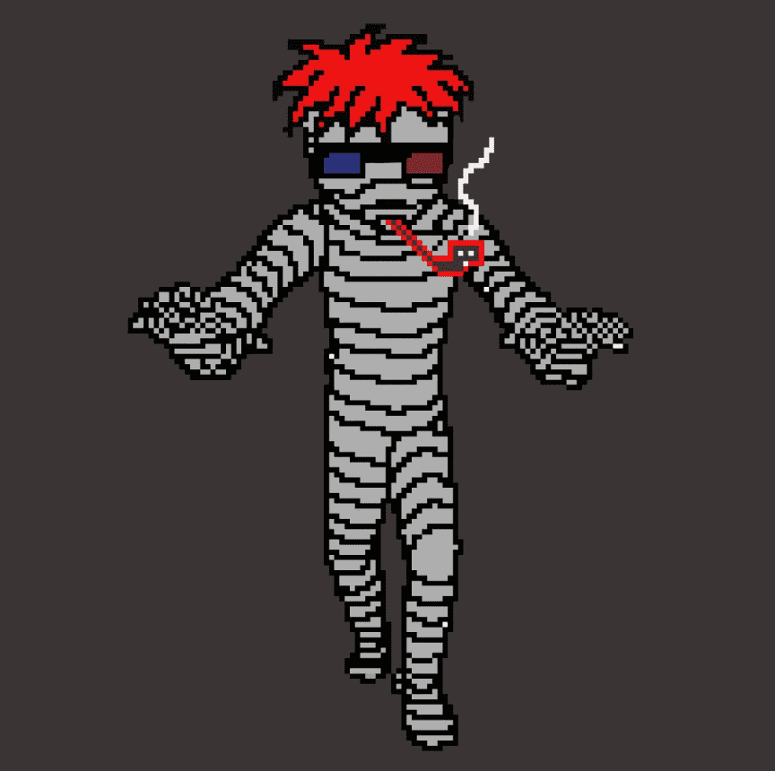

# ghost punk nft

▶ 什么是ghost punk nft？

ghost punk nft 是一个 NFT（非同质代币）系列。存储在区块链上的数字艺术品集合。

▶ ghost punk nft代币有多少？

总共有 5 ghost punk nft目前，2 位所有者的钱包中至少有一个 ghost punk nft。

▶ 哥特朋克俱乐部最近卖出了多少？

过去 30 天内共售出 0 个 ghost punk nft。

生活在 Klaytn 区块链上的计算机生成的生物。每个朋克鬼都在他自己的权利。在 Opensea 探索朋克

之魂

