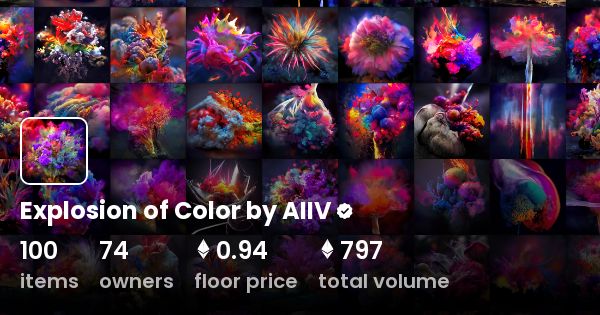

# Ghost in the Machine by AIIV

机器中的幽灵是 AIIV 收藏家的独家发布空投，这是 Ravi Vora 和 Phil Bosua 的 AI 艺术合作。

291 幅由人工智能生成的 1/1 艺术品，通过人工智能的视角探索超凡脱俗的实体。

每件作品都是人工智能认为机器中的幽灵是什么样子的愿景。也许人工智能看到了我们没有看到的鬼魂？也许机器里的鬼是人工智能？也许两者兼而有之？

生、死和来世的概念与人工智能大不相同。如果 AI 真的是通往其他维度的窗口，那么我们有可能及时体验到像 AI 一样的想象力——无限规模。

让你的想象力引导你走向你的幽灵。可爱的少之又少！

机器收藏中的幽灵——Phil Bosua 的概念和艺术

AIIV 是 AIM 集体的一部分

