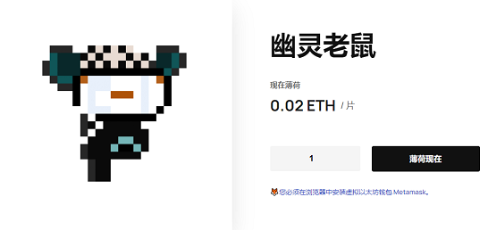

# Ghostmice

一个小村子里传来奇怪的声音，村民们都在大声喊叫，这一天来了吗？

他们一直反对烧掉议会里的老鼠！

他们觉得死老鼠会出现，会报复所有投票的人！

但？日子到了吗？

被烧死的老鼠的灵魂已经从死里复活了！村民们尖叫着“铸币”，这样他们就会永远被困在以太坊区块链上！

Ghostmice 作为ERC-72代币存储在以太坊区块链上并托管在 IPFS 上。购买 Ghostmice 需要0.02 ETH。

