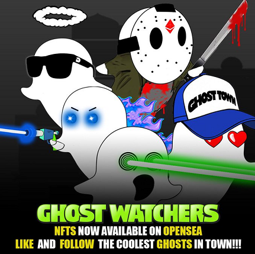

# Ghost Watchers

Ghost Watchers 是 2,500 个 Cool Ghost NFT 的第一个集合，在 Polygon 区块链上最酷的旅游恐怖景点 Ghost Town 上观看！！！

Ghost Watcher 持有者可以参与 NFT 认领、抽奖、社区赠品等独家活动。

All Ghost 将独家抢先获得限量版商品掉落，其中包括帽子、T 恤和连帽衫。

所有权还包括您的 Ghostwatcher 的创作权。

每个幽灵观察者都是通过结合 50 多种不同稀有度的属性（背景、牙齿、帽子、把手和特殊能力）生成的 AI

2021 年 10 月首次发布：2496 个独特的幽灵观察者

4 名超级稀有的幽灵观察者

即将推出的未来罕见的独特添加

目前正在为 2022 年第二季度开发视频游戏脚本

