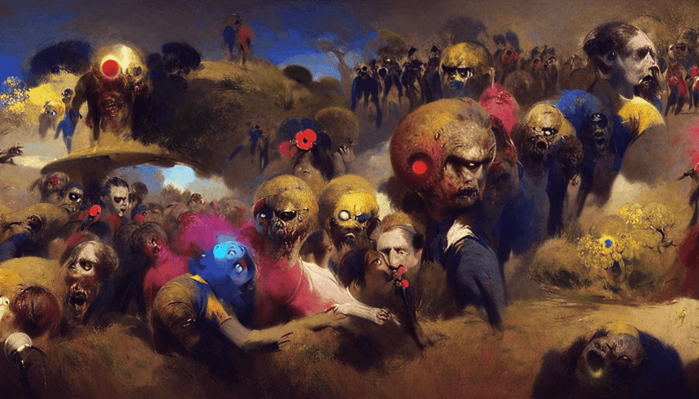

# Ghouls n GANs

这些关于死者和被诅咒者的景象令人恐惧，有时令人难以忘怀，探索了生活在我们集体想象中最黑暗角落的原始恐惧。

在 2022 年 4 月 25 日之前，所有者可以使用我们的 discord 机器人制作 GAN 艺术

▶ 什么是 Ghouls n GAN？

Ghouls n GANs 是一个 NFT（不可替代令牌）集合。存储在区块链上的数字艺术品集合。

▶ 存在多少 Ghouls n GANs 代币？

总共有 666 个 Ghouls n GANs NFT。目前，283 位所有者的钱包中至少有一个 Ghouls n GANs 

NTF。

▶ 最昂贵的 Ghouls n GAN 销售是什么？

售出的最昂贵的 Ghouls n GANs NFT 是 #521。它于 2022-08-21（12 天前）以 14.1 美元的价格售

出。

▶ 最近卖出了多少 Ghouls n GAN？

过去 30 天内售出了 1 个 Ghouls n GANs NFT。

