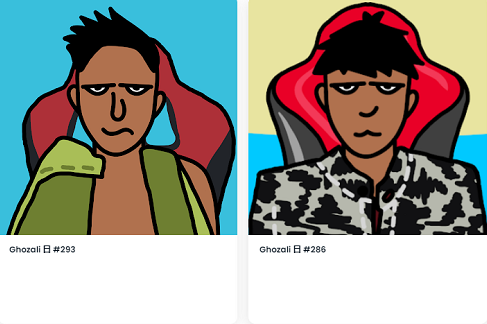

# Ghozali One Day

什么是 Ghozali One Day？

Ghozali One Day 是一个 NFT（非同质代币）集合。存储在区块链上的数字艺术品集合。

存在多少个 Ghozali 一日代币？

总共有 2,612 个 Ghozali 一日 NFT。目前，413 位所有者的钱包中至少有一个 Ghozali One Day NTF。

Ghozali 一生中最美好的时刻都记录在这个模因系列中。只有 10000 个 2D Ghozali 存在。15% 的销售额将直接流向 Ghozali。

Ghozali Everyday 现在是 2D 的！
Ghonzali 一生中最美好的时刻都记录在这个模因集合中。
15% 的销售额将直接流向 Ghozali。
前 2000 个 Ghozali 是免费的，然后每个 0.01 ETH 用于休息。
每笔交易最多 10 个。

