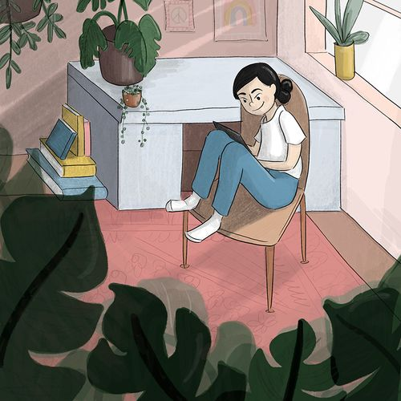
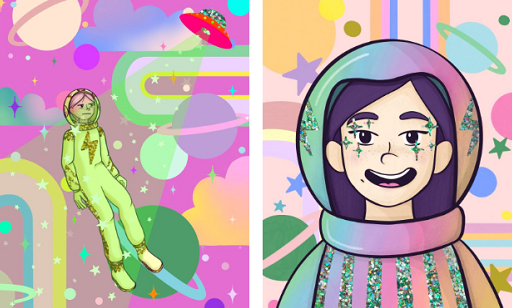

# Gimme Space Vol. 2

你好！我是丽莎。

我是德克萨斯州休斯顿的一名自学成才的艺术家和插画家。

从在停车场工艺品展览会上销售水彩画到为 web3 公司设计数字资产；我喜欢寻找创新和分享我的艺术的新方法！借鉴我在传统媒体方面的经验，我目前的工作是对数字调色板、纹理和动画进行实验。

受到 80 年代/90 年代怀旧、彩虹色和幽默的启发，我喜欢探索少女时代、冒险和恶作剧的主题。

在不久的将来，我希望将我的插图和人物带到印刷和媒体中。

我喜欢合作和梦想新事物。我最喜欢的项目是我可以探索新想法和工具的项目。

