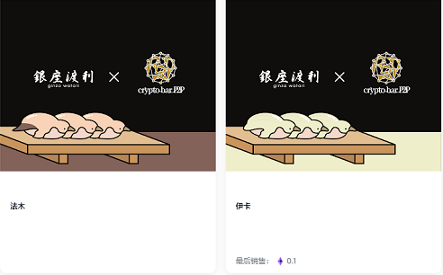

# GinzaWatari CryptoBarP2P collaboration

CryptoBar P2P 将与高端寿司餐厅 Ginza Watari 发行合作 NFT，并将于 2022 年 6 月 17 日举办活动，向合作 NFT 持有者提供 P2P 提供的特殊清酒和 Ginza Watari 寿司。投标人将获得特殊的 NFT。

什么是 GinzaWatari CryptoBarP2P 合作？

GinzaWatari CryptoBarP2P 协作是一个 NFT (Non-fungible token) 集合。存储在区块链上的数字艺术品集合。

 GinzaWatari CryptoBarP2P 协作代币有多少？

总共有 10 个 GinzaWatari CryptoBarP2P 协作 NFT。目前 10 位所有者的钱包中至少有一个 GinzaWatari CryptoBarP2P 协作 NTF。

GinzaWatari CryptoBarP2P 合作销售中最贵的是什么？

最昂贵的 GinzaWatari CryptoBarP2P 协作 NFT 是 Ika。它于 2022 年 6 月 15 日（2 个月前）以 112 美元的价格售出。

