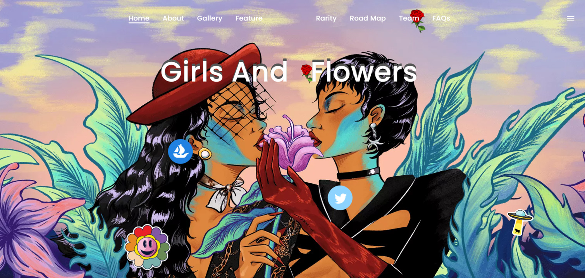

# Girls and flowers official

在我眼里，世间万物都是有生命的，我想用我的画笔记录下这些美好的事物，希望我的插画能给读者带来一些温暖。

我喜欢画机械和以美为主题的插图。明亮鲜艳的色彩是我的标志。

喜欢素描人像，有四年街头人像经验，与多家知名品牌合作，商业插画经验丰富，对插画有自己的理解。

我向往世间美好的事物，希望我的插画能给读者带来一些温暖。

这一系列作品是我这一年不断输出的创作。它充满了我对所有女性美丽的向往和敬畏。  女人的美不应该用任何形式来定义，每一朵女人花都有自己的花语，如夏花的绚烂，秋叶的静美。  女人像花一样美丽迷人，但花期很短，就像一场梦，开花后立即枯萎。  我想用我的作品展现女性的自信，拥抱万千女性的美丽，让这些花朵绽放。一瞬间，一瞬间就是永恒。
