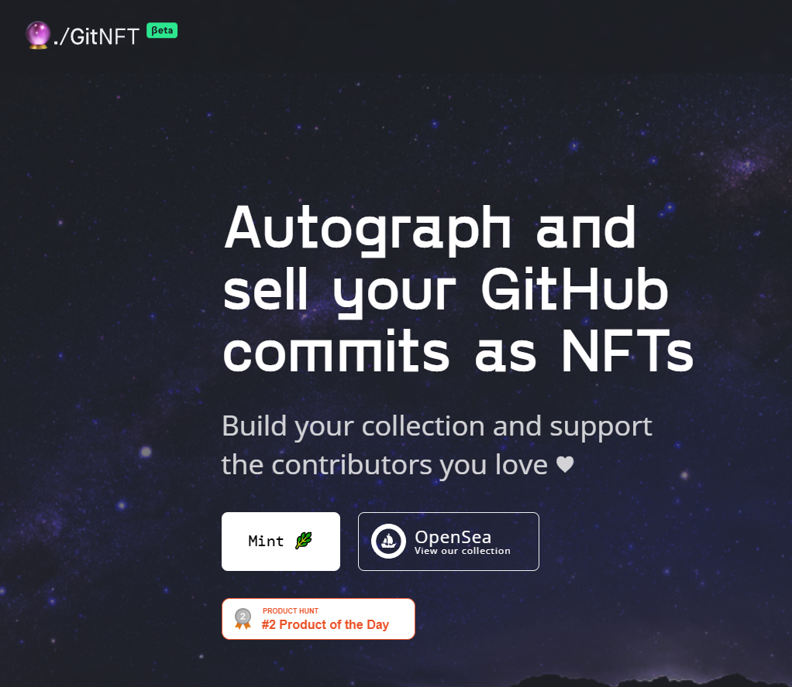

# GitNFTs

GitNFT 应用程序（由 Quine 构建）使用户能够在 GitHub 上创建其提交的 NFT。为此，用户通过 GitHub OAuth 证明提交的作者身份，并使用他们的以太坊钱包对提交进行加密签名。然后，应用程序创建（“mints”）提交的 NFT 表示多边形/矩阵区块链。

一旦提交被铸造为 NFT，作者可以选择保留、转移或使用 OpenSea 等 NFT 市场出售。

购买 GitNFT 是一种方式：
\1. 通过补偿其作者来表达对一段代码的欣赏。
\2. 与作者建立粉丝创作者关系。我们预计基于 NFT 所有权的社交网络和内容将越来越受欢迎。
\3. 策划您自己的传奇提交集合。

前往我们的OpenSea 集合看看目前市场上的 NFT！
‍您
还可以建议您希望将其视为 GitNFT 的提交！如果它获得足够的社区投票，作者可能会选择铸造它！

比特币和（目前）以太坊等基于工作量证明的区块链具有很高的环境足迹，这已被广泛描述。
‍ GitNFT
的智能合约——它跟踪 NFT、它们的所有权，并允许用户将它们相互转移——部署在以太坊侧链上，称为多边形（以前称为 Matic）。该侧链使用权益证明共识算法，其能源效率至少比 PoW 高 99%）。‍ GitNFT 的环境足迹
还有
每个 NFT 的元数据（每次提交的详细信息、作者等）都永久存储在名为Arweave. Arweave 使用一种称为“访问证明”的独特共识算法，该算法侧重于网络参与者证明他们正在存储某些数据。据我们所知，该链的环境影响尚未得到彻底计算，但根据其网络规模和使用情况，我们预计它的足迹小于以太坊的 0.5%。

