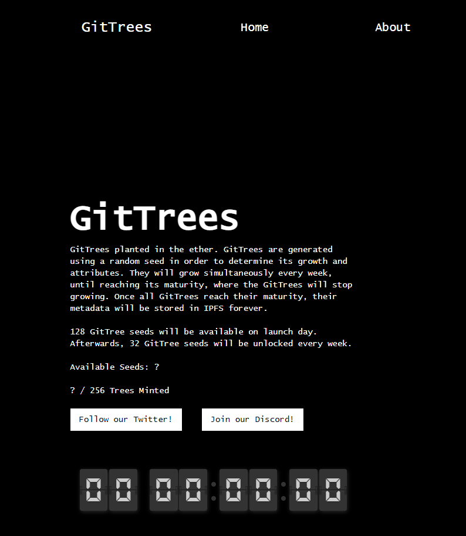

# GitTrees

GitTrees 种植在以太中。GitTrees 是使用随机种子生成的，以确定其增长和属性。它们每周都会同时生长，直到成熟，GitTrees 将停止生长。一旦所有 GitTrees 成熟，它们的元数据将永远存储在 IPFS 中。128 个 GitTree 种子将在发布当天提供，之后，每周将解锁 32 个 GitTree 种子。

## GitTree 生成器

所有 GitTree 都是通过 GitTree 生成器生成的，输入为随机种子。GitTrees 世代相传，直到它们完全成熟。

在所有的 GitTrees 被铸造和成熟之后，GitTree 生成器将被发布给公众，以尝试生成并查看不同种子的 GitTrees 会是什么样子。乐趣！

## 256 种子

以太坊中总共将种植 256 棵 GitTree，所有这些都从一个简单的种子开始。每颗种子都会长成自己独特的树。它们的生长将由随机生成的种子决定，并将相应地影响它们的物种和属性。

8 个 GitTrees 将保留给 AutoGlyph 所有者免费铸造。

## 树苗

随着时间的推移，GitTrees 将成长为树苗，准备好应对未来恶劣的以太环境。在这种状态下，他们成长为拥有自己的变体和设计。树苗可能看起来和其他树苗一样，但只有在它们长到成熟之前。

每一代人都需要一周的时间，这对快节奏的加密空间来说是一种真正不同的体验。GitTrees 的所有者将随着时间的推移见证他们的 GitTrees 年龄。拥有一个肯定需要耐心！

## 树木

GitTrees 成熟为许多不同类型的树。您可能种植了 4-8 步成熟的多肉植物、6-9 步成熟的花或 7-11 步成熟的树。

如果你已经将你的 GitTree 保存到了这个阶段，恭喜！
你有特殊的耐心和强壮的手，将引导你通过加密空间。
