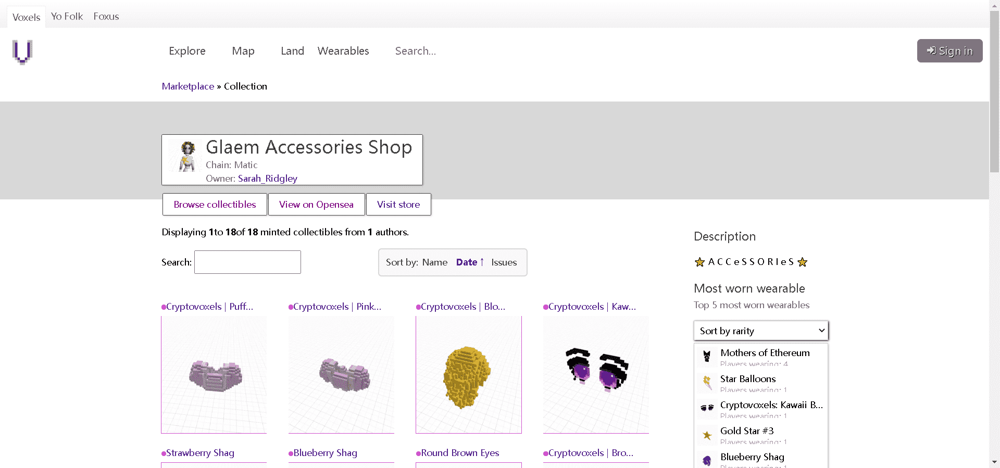

# Glaem Wearables

由@GlaemArt 制作并与 Cryptovoxels 完全集成的数字可穿戴设备。在 Matic 网络上可用。

购买可穿戴设备后，您可以将其添加到 Cryptovoxels 上的头像
--> 服装 --> 添加可穿戴设备

▶ 什么是 Glaem 可穿戴设备？
Glaem Wearables 是一个 NFT（非同质代币）系列。存储在区块链上的数字艺术品集合。

▶ 有多少 Glaem Wearables 代币？
总共有 18 个 Glaem Wearables NFT。目前，23 位所有者的钱包中至少有一个 Glaem Wearables NTF。

