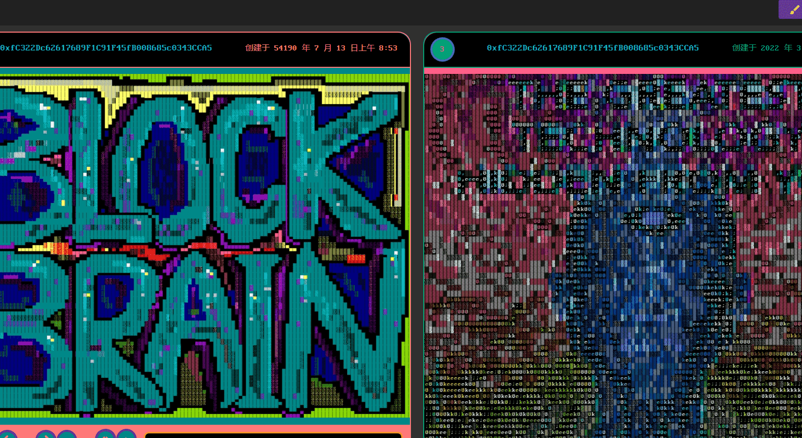

# glia.icu

没有两个代币可以是相同的，在链上经过散列和验证 - 铸造成本比大多数 NFT 都要高！

256 色 ANSI/文本艺术，具有可追溯到 1980 年代的历史价值，无需软盘 - 数据存储在链上！

令牌可以完全解码（开源和发布）并从区块链呈现。艺术也可以在计算机终端中查看，因为它的文本存储在链上，而不是文件系统上的图像，就像许多 NFTS 一样。

除非 ETH 不复存在，否则不会不复存在。抗审查。

令牌具有基于权限的神经网络元属性链接结构：这让您可以用它们做很酷的事情！

