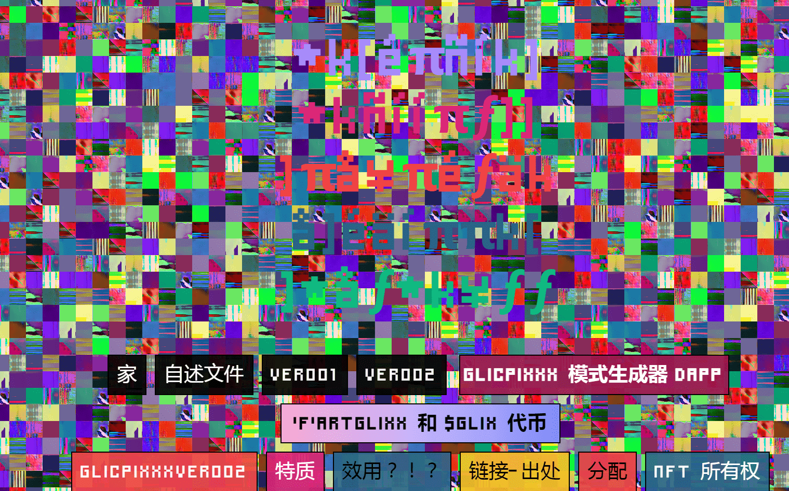

# GLICPIXXXVER002 - GRAND COLLECTION

GLICPIXXX 是一个希望提高创造力并鼓励艺术家和设计师在其作品中使用收藏中的 NFTS 作为原材料的项目。

由于它们是以太坊上的 ERC721 代币，因此在 NFT/DEFI 上已经有很多用例，我们每天都会看到新事物，因为这项技术将对我们的生活产生越来越大的影响。NFTS 4 生活宝贝！

但在这里，我想多关注一点艺术方面。因为我相信 GLICPIXXX 对当代/未来的视觉文化有很大的贡献/影响。

什么是 GLICPIXXX？它们是 32x32 的抽象故障图像，具有不同的颜色、图案、节奏（用于炒作）。它们是您从未见过的更大图像的片段。

有创意的人可以用 GLICPIXXX 做什么？我将在这里做一个简短的头脑风暴，所以希望你们中的一些人能找到很棒的想法来利用您的 GLICPIXXX。

