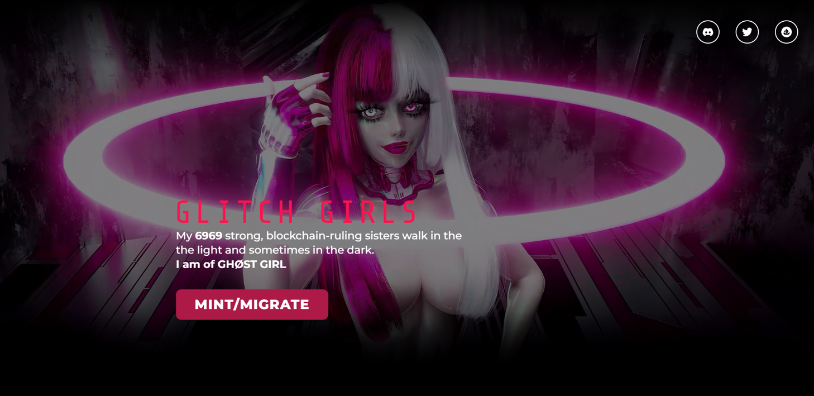

# Glitch Girls by GHOST GIRL

GHØST GIRL 对 Glitch Girls 的愿景是创造动态对比鲜明的角色（光与暗），然后将它们融合在一起创造出新的组合。考虑到这一点，她选择了相互对立但互补的物品和颜色方式。

通过女性气质和性欲寻找力量是贯穿她整个艺术的主题。她在成长过程中遇到了困难，并利用这种能量来激发她的艺术表达。

通过创造这些角色，让他们变得有趣和充满力量，她希望这种感觉能传达给其他人。她希望 Glitch Girls 成为社区驱动的，并与她的粉丝合作。

她创建这个项目的愿景是创建一个渠道，通过它我们可以建立更有意义的联系，共同建立一个很棒的社区！

Lindon，也被称为 GHØST GIRL，是一位 27 岁的亚裔美国视觉艺术家，以其 3D 动画和 VJ 表演而闻名。

她的许多灵感来自动漫、电子游戏和个人经历。一年多来，她一直在为 NFT 社区做出贡献。她发现这是一段奇妙的旅程，也是她爱上的社区！GHØST GIRL 珍惜她结交的朋友，他们对她的艺术的支持和热情让他们激动不已。看到她的工作以她从未想象或预料到的方式收到，她充满了感激之情。

通过创建和分享 Glitch Girls，她致力于继续与她的粉丝进行创造性的合作之旅。
