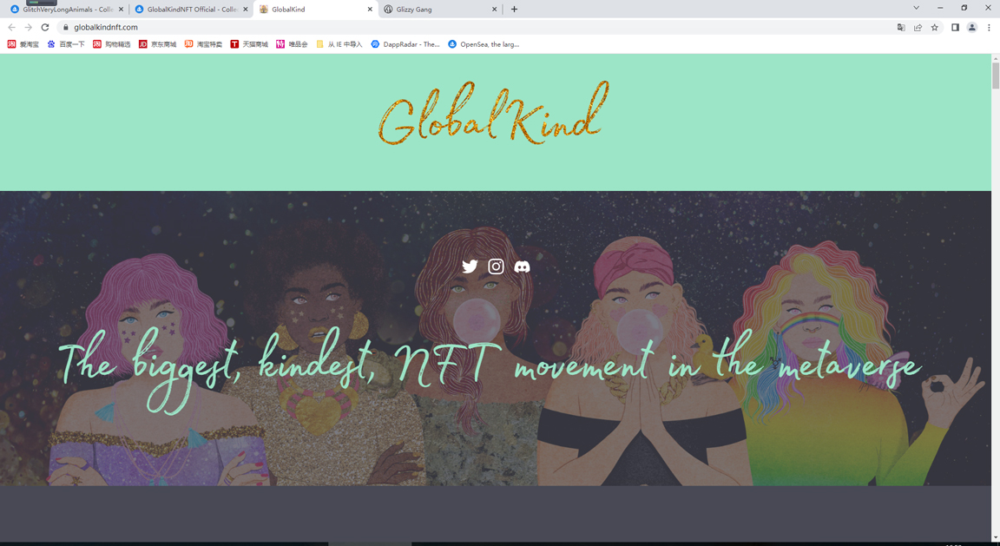

# GlobalKindNFT Official

GlobalKind 是一个为世界带来积极社会变革的品牌。 我们通过在自然和技术的交汇处进行设计来增强心理健康。7,777 名独特的强大生物生活在圣殿中。当他们在精神上、身体上、情感上和经济上从圣所获得力量时，他们给予和接受丰富。

由@amylilistudio aka @thecutefeminist 绘制的 7,777 NFT 手绘。GlobalKind 独特而令人惊叹的收藏包含使用 ERC-721a 合约存储在以太坊区块链上的 500 个独特特征。

我们一起生活在我们的元宇宙避难所，并建立在善良、友谊、可持续增长和多样性/平等/包容的核心价值观之上。

你是强大而善良的。我们可以一起取得更多成就，而不是单独行动。我们共同推动积极的社会变革。我们将一起让这个世界变得更美好。我们的 NFT 是为您服务的，它们是为了世界的利益。 

我们的 NFT 是您进入这个避难所的门票。

我们的承诺是共同努力，为您和世界推动积极的社会变革。

在 100% 的情况下，8% 的主要销售额将捐赠给符合我们愿景的慈善组织和我们的社区钱包，这些钱包将用于支持 NFT 中的艺术家。同样 100% 的铸币，15ETH 将流向元界的第一个 Sanctuary Genie，为我们的持有者提供身临其境的体验，他们可以实现一些愿望！我们的愿望是继续将 ETH 放入我们的 Sanctuary Genie。

我们还宣布了我们的珍珠和艺术收藏品，从 100% 的铸币开始 - 进入这些将需要你的 NFT 具有特定的特征 - 这将在铸币后揭晓！我们最近还宣布了我们的 Genesis 版税俱乐部，该俱乐部由我们Genesis 系列的持有者组成。我们将部分二次销售特许权使用费投资于这些团体。
