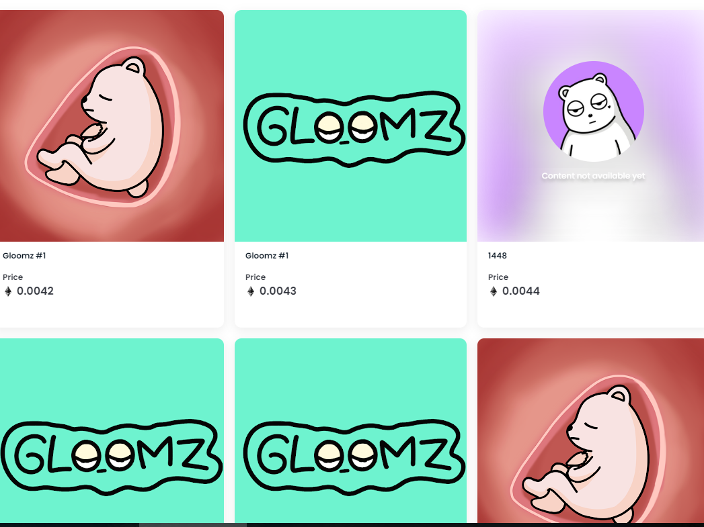

# Gloomz NFT

##### ▶ 什么是 Gloomz NFT？

Gloomz NFT 是一个 NFT（Non-fungible token）集合。存储在区块链上的数字艺术品集合。

##### ▶ 存在多少 Gloomz NFT 代币？

总共有 2,228 个 Gloomz NFT NFT。目前 552 位所有者的钱包中至少有一个 Gloomz NFT NTF。

##### ▶ 最昂贵的 Gloomz NFT 销售是什么？

售出的最昂贵的 Gloomz NFT NFT 是 Gloomz #1。它于 2022-06-18（2 个月前）以 5.5 美元的价格售出。

##### ▶ 最近卖出了多少 Gloomz NFT？

过去 30 天内售出了 17 个 Gloomz NFT NFT。

##### ▶ Gloomz NFT 的成本是多少？

在过去 30 天里，Gloomz NFT NFT 最便宜的销售额低于 2 美元，最高销售额超过 5 美元。过去 30 天内，Gloomz NFT NFT 的中位价格为 4 美元。
