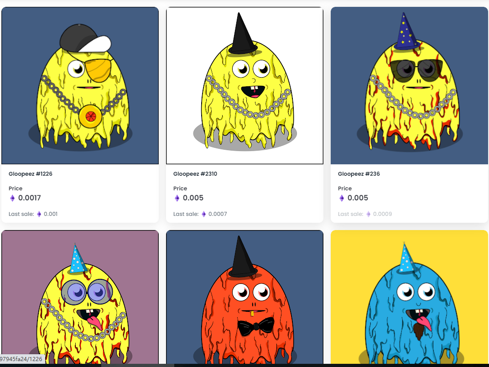

# GLOOPEEZ

##### ▶ 什么是 GLOOPEEZ？

GLOOPEEZ 是一个 NFT（不可替代代币）集合。存储在区块链上的数字艺术品集合。

##### ▶ 有多少 GLOOPEEZ 代币？

总共有 2,500 个 GLOOPEEZ NFT。目前，232 位所有者的钱包中至少有一个 GLOOPEEZ NTF。

##### ▶ 最近卖出了多少 GLOOPEEZ？

过去 30 天内售出 0 个 GLOOPEEZ NFT。

