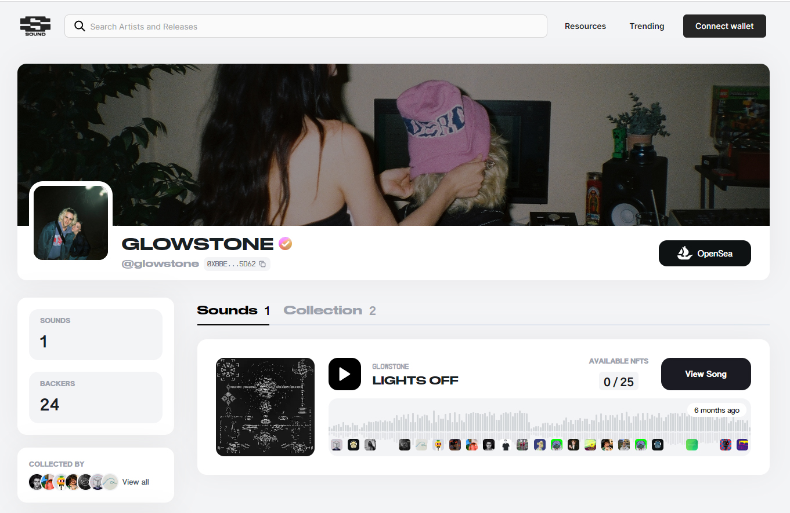

# GLOWSTONE

声音就是音乐应该有的样子：由听众和艺术家之间的关系驱动。

我们正在为基于 web3 技术和价值观的更具协作性的音乐运动创建一个平台。

在 Sound 上，用户直接支持他们喜爱的艺术家，并声称他们比其他人更早到达那里。

推出新曲目应该是一个事件，而不是事后的想法。声音让艺术家有机会以一组 NFT 的形式推出新音乐。NFT 的每个版本都有唯一的编号，因此听众可以展示他们早期的支持。

由于早期版本被认为比后期版本更有价值，因此鼓励支持者及早发现新音乐。

每个 Sound NFT 都不仅仅是一首歌。拥有歌曲的 NFT 可以让支持者对歌曲发表公开评论——让全世界知道你的想法！卖掉你的 NFT，你的评论就会消失，被新主人取代。

炫耀您收集的 Sound NFT，并证明您是过去的粉丝。你能找到下一个大声音吗？

除了拥有这首歌并在其历史上刻下您的名字之外，Sound NFT 是您进入 Discord 上 Sound 社区的通行证，艺术家和听众通过每周的聚会、协作项目等方式相互交流。

