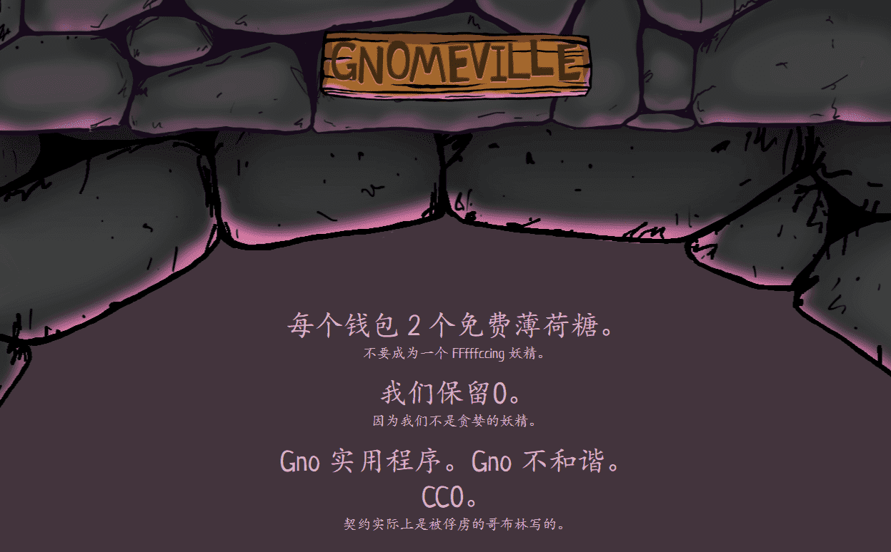

# GNO GNO GNO 侏儒侏儒

 什么是 Gnomeville？
Gnomeville 是一个 NFT（不可替代令牌）集合。存储在区块链上的数字艺术品集合。

有多少 Gnomeville 代币？
总共有 8,888 个 Gnomeville NFT。目前，3,670 名所有者的钱包中至少有一个 Gnomeville NTF。

最近卖出了多少 Gnomeville？
过去 30 天内售出了 6,520 个 Gnomeville NFT。

