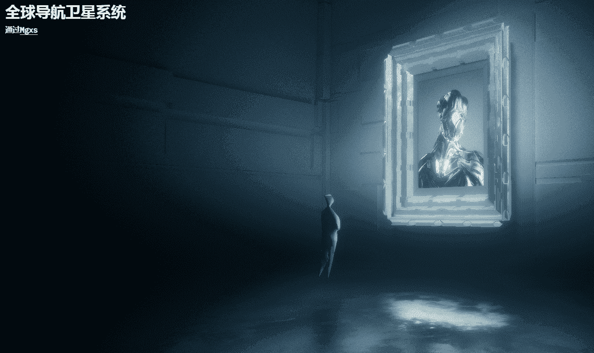

# GNSS by MGXS

GNSS 是我尝试重新创造自然，一种来自不同时间线的自然，玩弄物质及其进化路径。

和你一样，每个人都是独一无二的。从零中产生，它们以奇异的生命形式出现，融合了先进的技术和艺术。

这是我痴迷于美与机器联盟的结果，这是我 4 年多来一直在发展的美学。

到目前为止，我一个人创造了这个，但现在我邀请你扮演上帝。

Fernando Magalhães，又名 MGXS，是一位使用程序和生成系统工作的生成艺术家。

他的头脑非常活跃，总是在寻找能够激发他想象力的形式和形状，在他的疯狂科学家实验室中将它们干燥和解码。

Gnss是多年研发的结晶，MGXS邀您一起结束本章。

