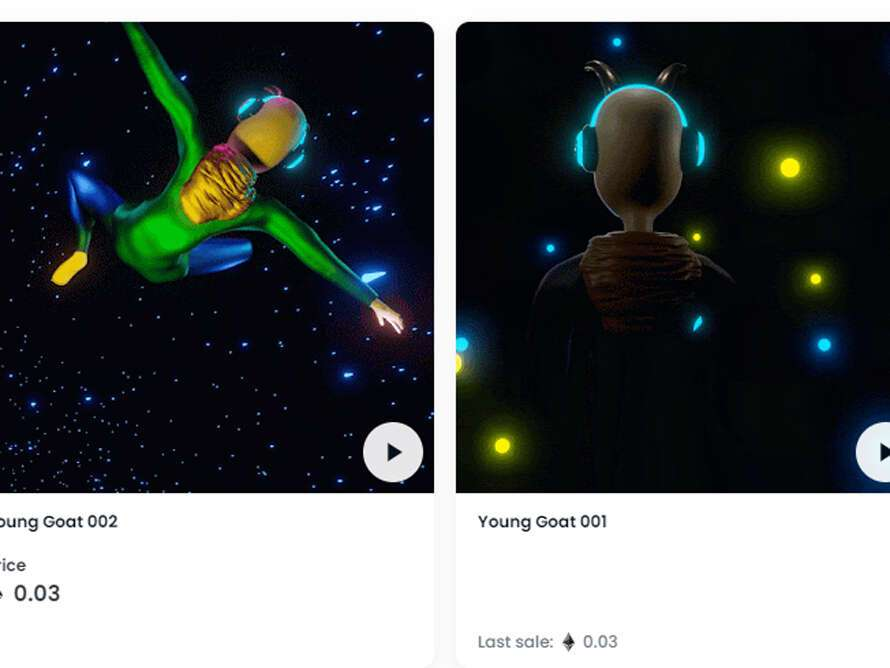

# GOATATONIC

##### ▶ 什么是山羊绒？

GOATATONIC 是一个 NFT（非同质代币）集合。存储在区块链上的数字艺术品集合。

##### ▶ GOATATONIC 代币有多少？

总共有 2 个 GOATATONIC NFT。目前 2 位所有者的钱包中至少有一个 GOATATONIC NTF。

##### ▶ GOATATONIC 最昂贵的销售是什么？

售出的最昂贵的 GOATATONIC NFT 是 Young Goat 001。它于 2022 年 6 月 20 日（2 个月前）以 32.9 美元的价格售出。

##### ▶ 最近卖出了多少GOATATONIC？

过去 30 天内售出 1 个 GOATATONIC NFT。
